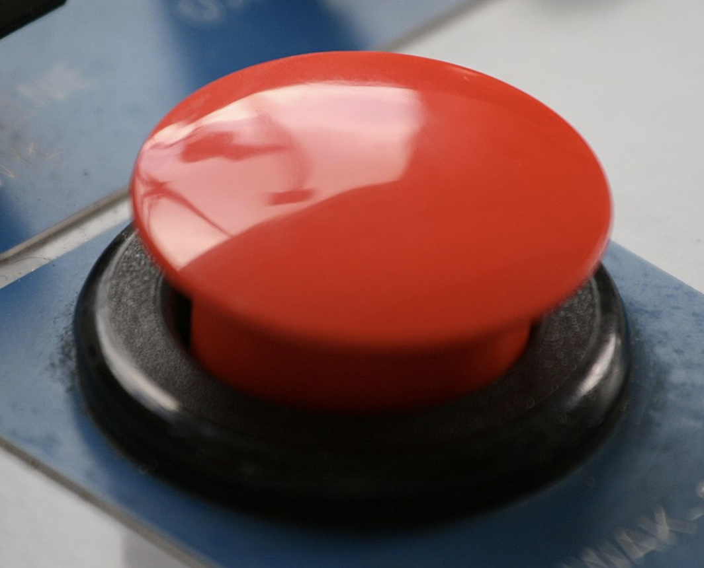

# HotButton

#### Arduino button library, but with a twist



There's plenty of libraries that handle button presses for Arduinos and everything programmed alike. They all do debouncing (making sure a button press is not counted many times because the button contacts are imperfect) and they all tell you if a button is pressed. Some will even tell you if a button is doubleclicked.

But I had a development board in my hands with only one button, and I wanted it to do a few different things, depending on how I pressed the button. So I built HotButton, which allows for all sorts of keypress-events to be detected.

### Simplest usage

If you just need any old button library, HotButton is just fine for that. Install HotButton with the library manager and then simply do:

```cpp
#include <HotButton.h>

HotButton myButton(10);  // 10 = GPIO pin your button is attached to

void setup() {
  Serial.begin(115200);
}

void loop() {
  myButton.update();
  if (myButton.isSingleClick()) {
    Serial.println("The button was clicked.");
  }
  if (myButton.isDoubleClick()) {
    Serial.println("The button was double-clicked.");
  }
}
```

### Events

With HotButton you can do more. Any series of up to four keypresses that are not more than 250 milliseconds apart are considered a single event. And you can use `.event()` to check if the user pressed any of the events you care about. For instance, if you would like to detect a short and a long press, simply use `if (button.event(SHORT, LONG))`.

&nbsp;

### Function reference

&nbsp;

#### `#include <HotButton.h>`

Must be at beginning of your program to use HotButton.

&nbsp;

#### `HotButton myButton(<pin>, <pullup>=false, <active>=LOW)`

This is how you set things up. Do this before your `setup()` function. `myButton` here is just whatever name you want to given this particular button. You can have as many as you like. `<pin>` is the number of the GPIO pin your button is attached to and it's the only argument you must provide. Optionally, you can specify that you'd like to use your controller's built-in pull-up resistor on that pin (default is no), and whether the button connects the pin to the power instead of to ground. (Default is to ground, which is most common.) 

&nbsp;

#### All the following functions must be prefixed by the name of your button. 

For example: `myButton.update()`

&nbsp;

#### `.update()`

This must be put in your sketch's `loop()` function for every button you define for HotButton to work.

&nbsp;

#### `.isSingleClick()` `.isDoubleClick()`

#### `.isTripleClick()`, `.isQuadrupleClick()`

These are obvious. Your code will detect one of these events 250 ms after the last button release. Note that this only responds to short clicks.

&nbsp;

#### `.pressed()`

This will be true once for every time the button is pressed, immediately after the button is pressed. This is independent from any events that this buttonpress may be part of.

&nbsp;

#### `.pressedNow()`

This is true again and again as long as button is pressed. In other words, it gives you the current state of the button.

&nbsp;

#### `.pressedFor(<ms>)`

Is true once as soon as the button is held down for this number of milliseconds. Your `loop()` can have multiple of these, so if you have a number of these tests for different durations, they will each be true once (and only once) when that duration is reached.

&nbsp;

#### `.waitForPress()`

Your code waits here until the button is pressed, not detecting any other buttons, or doing anything but waiting for the buttonpress. Returns immediately if the button is already pressed when you call it.

&nbsp;

#### `.waitForRelease()`

Your code waits here until the button to be released, not detecting any other buttons, or doing anything but waiting for the buttonpress. Returns immediately if the button is not pressed when you call it.

&nbsp;

#### `.event(...)`

This is the most powerful function. It takes between one and four arguments, each describing a seubsequent keypress of a key event. Each argument must take one of three possible forms

##### &nbsp;&nbsp;&nbsp;&nbsp;&nbsp;&nbsp;&nbsp;`UNDER(<ms>)`

##### &nbsp;&nbsp;&nbsp;&nbsp;&nbsp;&nbsp;&nbsp;`BETWEEN(<ms>, <ms>)`

##### &nbsp;&nbsp;&nbsp;&nbsp;&nbsp;&nbsp;&nbsp;`OVER(<ms>)`

for button presses under, between or over the set number of milliseconds. Note that all pressed of more than 2550 ms are counted as 2550 ms and the value specified here should not exceed 2550. (You can use `.pressedFor(<ms>)` to see if a button is held for longer.)

The library provides the folowing shorter notations:

```cpp
#define DIT             UNDER(200)
#define SHORT           DIT
#define DA              OVER(200)
#define LONG            DA
```

So assuming we want to detect the morse letter V, which is &nbsp; · · · ⎯ &nbsp; in morse code. 

```cpp
if (myButton.event(DIT, DIT, DIT, DA)) {
  Serial.println("V for Victory !");
}
```
